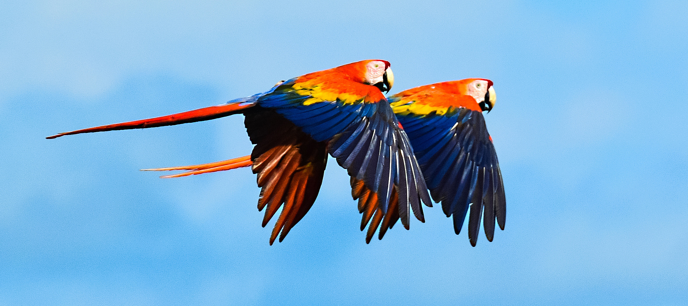
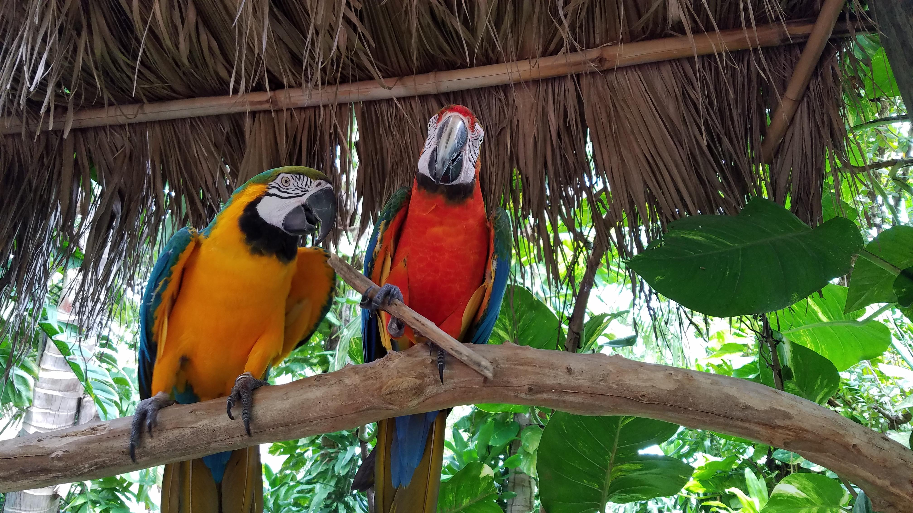

Macaws are long-tailed, often colorful, New World parrots. They are popular in aviculture or as companion parrots, although there are conservation concerns about several species in the wild.

### Biology

Of the many different [Psittacidae](https://en.wikipedia.org/wiki/Psittacidae) (true parrots) genera, six are classified as macaws: Ara, Anodorhynchus, Cyanopsitta, Primolius, Orthopsittaca, and Diopsittaca. Previously, the members of the genus Primolius were placed in Propyrrhura, but the former is correct in accordance with [ICZN](https://en.wikipedia.org/wiki/International_Commission_on_Zoological_Nomenclature) rules. Macaws are native to Central America and North America (only Mexico), South America, and formerly the Caribbean. Most species are associated with forests, especially rainforests, but others prefer woodland or savannah-like habitats.

<figure class="blog-image-right">
	
	<figcaption>Two macaws in flight.</figcaption>
</figure>

Proportionately larger beaks, long tails, and relatively bare, light-coloured, medial (facial patch) areas distinguish macaws from other parrots. Sometimes the facial patch is smaller in some species and limited to a yellow patch around the eyes and a second patch near the base of the beak in the members of the genus Anodorhynchus. A macaw's facial feather pattern is as unique as a fingerprint.

The largest macaws are the [hyacinth](https://en.wikipedia.org/wiki/Hyacinth_macaw), Buffon's (great green) and green-winged macaws. While still relatively large parrots, mini-macaws of the genera Cyanopsitta, Orthopsittaca and Primolius are significantly smaller than the members of Anodorhynchus and Ara. The smallest member of the family, the red-shouldered macaw, is no larger than some parakeets of the genus Aratinga.

Macaws, like other parrots, toucans and woodpeckers, are zygodactyl, having their first and fourth toes pointing backward.

### Extinctions and conservation status

The majority of macaws are now endangered in the wild and a few are extinct. The Spix's macaw is now probably extinct in the wild. The glaucous macaw is also probably extinct, with only two reliable records of sightings in the 20th century. The greatest problems threatening the macaw population are the rapid rate of deforestation and illegal trapping for the bird trade. Prehistoric Native Americans in the American Southwest farmed macaws in establishments known as "feather factories".

International trade of all macaw species is regulated by the Convention on International Trade in Endangered Species of Wild Flora and Fauna (CITES). Some species of macaws—the scarlet macaw (Ara macao) as an example—are listed in the CITES Appendix I and may not be lawfully traded for commercial purposes. Other species, such as the red-shouldered macaw (Diopsittaca nobilis), are listed in Appendix II and may legally be traded commercially provided that certain controls are in place, including a non-detriment finding, establishment of an export quota, and issuing of export permits.

<figure class="blog-image-horizontal">
	
	<figcaption>A blue-and-yellow macaw</figcaption>
</figure>

### Hybrids

Sometimes macaws are hybridized for the pet trade.

Aviculturists have reported an over-abundance of female blue-and-yellow macaws in captivity, which differs from the general rule with captive macaws and other parrots, where the males are more abundant.[citation needed] This would explain why the blue and gold is the most commonly hybridised macaw, and why the hybridising trend took hold among macaws. Common macaw hybrids include the harlequin (Ara ararauna × Ara chloroptera), miligold macaw (Ara ararauna × Ara militaris) and the Catalina (known as the rainbow in Australia, Ara ararauna × Ara macao). In addition, unusual but apparently healthy intergeneric hybrids between the hyacinth macaw and several of the larger Ara macaws have also occasionally been seen in captivity.

<figure class="blog-image-horizontal">
	
	<figcaption>Two different coloured Macaws.</figcaption>
</figure>

Macaws eat a variety of foods including seeds, nuts, fruits, palm fruits, leaves, flowers, and stems. Wild species may forage widely, over 100 km (62 mi) for some of the larger species such as Ara araurana (blue and yellow macaw) and Ara ambigua (great green macaw), in search of seasonally available foods.
